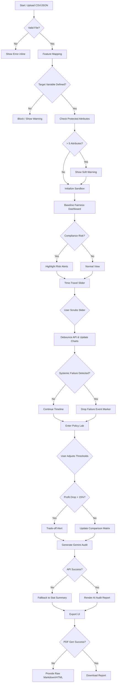

# 🗺️ DecisionTwin: Complete User Journey & Logic Flow

**Prepared by:** Lead UX Architect
**Objective:** Transform complex longitudinal AI fairness simulations into an intuitive, engaging, and highly visual experience.

---

## 1️⃣ Phase 1: Onboarding (Data & Context)
*The critical first impression. We need to make data ingestion feel effortless and feature mapping semantically clear.*

**Step 1: Dataset Upload**
* **Action:** User is presented with a sleek, glassmorphic drag-and-drop zone. They upload their historical decision data (CSV).
* **If-Then Logic Flow:**
  * **IF** file is valid (.csv / .json) and under size limits -> **THEN** trigger a smooth "parsing" micro-animation. Move to Step 2.
  * **IF** file format is unsupported -> **THEN** shake the dropzone slightly, turn border red, and show error inline: *"Oops! We only support .csv or .json files for now."*
  * **IF** upload is interrupted/fails -> **THEN** display a retry toaster notification.

**Step 2: Feature Mapping**
* **Action:** The system automatically extracts column headers. The user drags headers into two distinct buckets: **Target Variables** (e.g., Credit Approval) and **Protected Attributes** (e.g., Age, Zip Code, Gender).
* **If-Then Logic Flow:**
  * **IF** the system auto-detects common protected attributes (e.g., "Gender") -> **THEN** pre-fill the bucket and add a glowing "Auto-Detected" badge for user verification.
  * **IF** user tries to proceed without defining a Target Variable -> **THEN** disable the 'Initialize Twin' button and display tooltip: *"DecisionTwin needs a Target Variable to run its simulation."*
  * **IF** user selects more than 5 Primary Protected Attributes -> **THEN** show a soft warning: *"Tracking over 5 attributes may cause visual clutter. Consider grouping them."*

---

## 2️⃣ Phase 2: The Twin Sandbox (Current State)
*Setting the baseline. This dashboard provides immediate impact visibility before any time-travel occurs.*

**Step 3: Baseline Fairness Dashboard**
* **Action:** User lands on the main dashboard displaying real-time metrics for Disparate Impact, Demographic Parity, and current Profit/Loss margins.
* **If-Then Logic Flow:**
  * **IF** metrics fall below legal compliance thresholds (e.g., < 80% rule) -> **THEN** pulse the specific metric card in a warning color (amber/red) and attach a "Risk Detected" icon.
  * **IF** the dashboard fails to fetch the initial metric payload -> **THEN** display skeleton loaders for the graphs and an error state: *"Calibrating your Twin... Hang tight, this is taking longer than usual."*
  * **IF** user clicks on a specific metric card -> **THEN** expand an accordion/modal with a plain-english explanation of what the metric means.

---

## 3️⃣ Phase 3: The Simulation Mode (Longitudinal Impact)
*The core engine. Users interact with the "Time-Travel Slider" to see compounding bias over time.*

**Step 4: The Time-Travel Slider (Year 1 to Year 10)**
* **Action:** User drags a highly tactile slider across a 10-year timeline. As the slider moves, dynamic charts representing 'Wealth Gaps', 'Rejection Rates', and 'Feedback Loops' morph smoothly.
* **If-Then Logic Flow:**
  * **IF** slider is scrubbed rapidly -> **THEN** debounce the API calls, animate the line graphs with a smooth Bezier curve transition, and show an interpolated state to avoid stuttering.
  * **IF** the simulation engine throws a timeout error during a future year calculation -> **THEN** pause the slider progression, show a subtle loading spinner on the slider thumb, and display: *"Calculating complex societal impacts..."*
  * **IF** a catastrophic diverging trend is detected (e.g., one demographic is completely locked out of credit by Year 5) -> **THEN** drop a visual "Event Marker" on the timeline indicating a "Systemic Failure Point".

---

## 4️⃣ Phase 4: The Policy Lab (Intervention)
*Empowering the user to fix the future. Here, they tweak the algorithm and observe trade-offs.*

**Step 5: 'What-If' Trade-off Toggles**
* **Action:** User enters the Policy Lab to adjust decision thresholds (e.g., lowering the cutoff score for marginalized groups) and views a comparison matrix of **Profit vs. Fairness**.
* **If-Then Logic Flow:**
  * **IF** user adjusts a threshold that increases Fairness but tanks Profit by >15% -> **THEN** trigger a dynamic "Trade-off Alert" overlay highlighting the financial friction.
  * **IF** user inputs an invalid threshold parameter (e.g., text instead of numerical, or out of bounds) -> **THEN** instantly revert to the last valid number and flash a red border on the input field.
  * **IF** user wants to save a "What-If" scenario -> **THEN** allow them to snapshot the current state and pin it to a side-panel for side-by-side comparison.

---

## 5️⃣ Phase 5: The Final Output (Actionable Insights)
*Translating simulation into executive action.*

**Step 6: Gemini Forensic Audit Report Generation**
* **Action:** User clicks "Generate Audit". The platform leverages Gemini to synthesize the observed biases, the root causes (feature correlations), and recommended policy changes.
* **If-Then Logic Flow:**
  * **IF** the LLM generation takes more than 3 seconds -> **THEN** show an engaging processing screen stating: *"Gemini is analyzing 10 years of simulated decisions..."*
  * **IF** Gemini encounters a context/token limit or API failure -> **THEN** fallback to rendering a structured, template-based statistical summary and display a toast: *"AI summary momentarily unavailable. Viewing raw statistical export."*
  * **IF** user clicks 'Export to PDF' -> **THEN** strip all interactive web elements, apply the print-stylesheet, and trigger browser download. 
  * **IF** the PDF generation fails -> **THEN** present a direct download link for a raw markdown/HTML version of the report, ensuring the user leaves with their data.

---

## 🧠 System Architecture Visualization Flow

